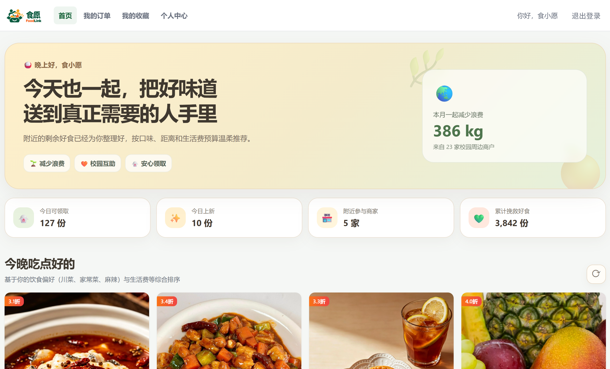

# FoodLink（食愿）

> 食有所余，愿有所达。

FoodLink（食愿）是面向校园学生与周边商家的余量食物互助 Web 平台。商家可以发布临期或余量餐食，学生可以浏览优惠商品、下单并凭 6 位取货码领取，管理员负责商家审核、风险记录和数据统计。



## 当前完成情况

本仓库正在多人协作开发。下表以**当前仓库中实际可运行的代码**为准：

| 部分 | 当前状态 | 说明 |
| --- | --- | --- |
| Vue Web 前端 | 已提供 | 学生端、商家端和管理员端页面均已建立，开发环境默认使用 Mock 数据 |
| 前端 Mock 接口 | 已提供 | 可独立演示登录、商品、订单和后台管理等主要流程 |
| Python 公共后端基础 | 已提供 | FastAPI、SQLAlchemy、SQLite、JWT 校验、统一响应和 Swagger 已配置 |
| Python 订单模块 | 已实现并测试 | 支持下单、订单列表、按订单 ID 核销和按取货码核销 |
| 认证、用户、商品、推荐、管理真实接口 | 待实现或待合并 | 当前 FastAPI 应用中尚未注册这些接口，相关页面目前由 Mock 数据支持 |
| 前后端真实接口联调 | 待进行 | 需等认证、商品等后端接口接入后，再关闭前端 Mock 完整联调 |

> `api.md` 是团队接口契约，不等于其中所有接口都已经在当前 Python 服务中实现。后端实际开放的接口请以启动后的 [Swagger](http://localhost:8080/doc.html) 为准。

## 技术栈

| 位置 | 技术 |
| --- | --- |
| 前端 | Vue 3、Vite、Vue Router、Pinia、Axios、Leaflet |
| 后端 | Python 3.9+、FastAPI、SQLAlchemy 2、PyJWT |
| 数据库 | SQLite |
| 接口文档 | FastAPI Swagger UI（`/doc.html`） |
| 自动化测试 | Pytest、HTTPX |

## 主要功能

- 学生端：登录注册、个性化推荐、猜你喜欢、商品详情、收藏、下单、订单查询和取货凭证。
- 商家端：商品列表、发布商品、订单管理和取货码核销。
- 管理员端：商家审核、风险日志和数据看板。
- 订单后端：原子扣减库存、生成唯一 6 位数字取货码、订单状态流转、订单过期处理、商家数据隔离和防止重复核销。

## 项目结构

```text
FoodLink/
├── frontend/                    # Vue 3 Web 前端及开发用 Mock 接口
│   ├── mock/                    # Vite Mock 数据与接口
│   └── src/                     # 页面、组件、路由、状态和 API 请求
├── backend/                     # Python FastAPI 后端（当前已完成订单模块）
│   ├── app/                     # 应用入口、模型、鉴权和订单业务
│   ├── scripts/                 # 演示数据与开发 Token 工具
│   └── tests/                   # 后端自动化测试
├── docs/api-integration.md      # 前端接口对接清单
├── api.md                       # 团队接口契约
├── FoodLink_readme_V1.0.docx    # 项目初始需求与设计文档
└── landing.png                  # 项目首页预览图
```

## 快速启动前端

准备环境：Node.js 18+ 和 npm。

```bash
cd frontend
npm ci
npm run dev
```

浏览器访问 <http://localhost:5173>。

开发环境的 `frontend/.env.development` 已设置 `VITE_USE_MOCK=true`，因此只启动前端也能演示完整页面，不需要先启动后端。

### 前端 Mock 演示账号

| 角色 | 账号 | 密码 |
| --- | --- | --- |
| 学生 | `2021001` | `123456` |
| 商家 | `shop001` | `123456` |
| 管理员 | `admin` | `123456` |

这些账号只存在于前端 Mock 数据中，不是真实后端登录账号。

## 快速启动 Python 后端

准备环境：Python 3.9+。

```bash
cd backend
python3 -m venv .venv
source .venv/bin/activate
python -m pip install -r requirements-dev.txt
cp .env.example .env
python -m scripts.seed_demo
uvicorn app.main:app --reload --port 8080
```

启动后可访问：

- 健康检查：<http://localhost:8080/api/health>
- Swagger 接口文档：<http://localhost:8080/doc.html>
- OpenAPI JSON：<http://localhost:8080/openapi.json>

SQLite 数据库默认保存在 `backend/data/foodlink.db`，该文件不会提交到 Git。

### 在 Swagger 中调试订单接口

当前后端尚未实现登录接口，可使用开发脚本生成 JWT Token。先查看 `seed_demo` 输出的用户 ID，再按角色生成 Token：

```bash
# 学生 Token，用于下单和查看本人订单
python -m scripts.create_dev_token --user-id 1 --role 1

# 商家 Token，用于查看本店订单和核销
python -m scripts.create_dev_token --user-id 2 --role 2

# 管理员 Token，用于核销订单
python -m scripts.create_dev_token --user-id 3 --role 3
```

打开 Swagger，点击右上角 `Authorize`，填入脚本输出的 Token 后即可调用接口。如果本地数据库中已有数据，用户 ID 可能不同，请以种子脚本的实际输出为准。

## 已实现的订单接口

| 方法 | 路径 | 权限 | 说明 |
| --- | --- | --- | --- |
| `POST` | `/api/orders` | 学生 | 创建订单、扣减库存并生成 6 位取货码 |
| `GET` | `/api/orders` | 学生/商家 | 学生查看本人订单，商家查看本店订单；可按 `status` 筛选 |
| `PUT` | `/api/orders/{id}/pickup` | 商家/管理员 | 按订单 ID 确认领取 |
| `POST` | `/api/orders/verify` | 商家/管理员 | 按 6 位取货码确认领取 |

创建订单请求示例：

```json
{
  "product_id": 1,
  "quantity": 1
}
```

订单状态：`0` 待领取、`1` 已领取、`2` 已过期。订单金额在数据库中使用 `DECIMAL(10,2)`，接口以两位小数字符串返回，例如 `"12.00"`，避免浮点精度问题。

## 前后端联调

前端切换到真实接口前，将 `frontend/.env.development` 改为：

```dotenv
VITE_API_BASE=http://localhost:8080
VITE_USE_MOCK=false
```

然后重新启动前端。Axios 会自动为请求添加 `Authorization: Bearer <token>`，Vite 会把 `/api` 请求代理到 `http://localhost:8080`。

> 当前真实后端只有健康检查和订单相关接口。关闭 Mock 后，登录、商品、推荐和管理员页面会因对应后端接口尚未接入而无法完整使用。

## 接口统一约定

- 成功响应统一为 `{ "code": 0, "message": "success", "data": ... }`，其他 `code` 表示失败。
- 时间统一使用 `yyyy-MM-dd HH:mm:ss`，订单后端采用 `Asia/Shanghai` 时区。
- 数据库金额统一使用 `DECIMAL`，接口使用两位小数字符串传输，不使用二进制浮点数。
- 需要鉴权的接口统一使用请求头 `Authorization: Bearer <token>`。
- 角色编号统一为：`1` 学生、`2` 商家、`3` 管理员。
- 接口字段和错误码以 `api.md` 为团队约定；可运行状态以 Swagger 和当前代码为准。

## 测试与构建

后端测试：

```bash
cd backend
source .venv/bin/activate
pytest
```

前端生产构建：

```bash
cd frontend
npm ci
npm run build
```

## 团队协作约定

团队目前确认直接在 `main` 分支协作。每次开始开发前先在 GitHub Desktop 点击 `Fetch origin`，如有远程更新再点击 `Pull origin`；完成一个小功能后及时提交并 `Push origin`，不要等全部完成后一次上传。

提交信息应写清楚“改了什么”，例如：

```text
feat(backend): 实现订单创建与6位取货码
test(backend): 补充订单核销测试
docs: 更新项目启动说明
```

只修改自己负责的模块；遇到冲突时先和对应队友确认，不要强制覆盖或删除他人的代码。`.env`、本地数据库、虚拟环境和依赖目录不要提交到 Git。

## 相关文档

- [团队接口契约](./api.md)
- [前端接口对接清单](./docs/api-integration.md)
- [订单后端详细说明](./backend/README.md)

`FoodLink_readme_V1.0.docx` 记录了项目早期方案，其中部分技术选型可能与当前代码不同；开发和运行时以本 README、当前源码和 Swagger 为准。
